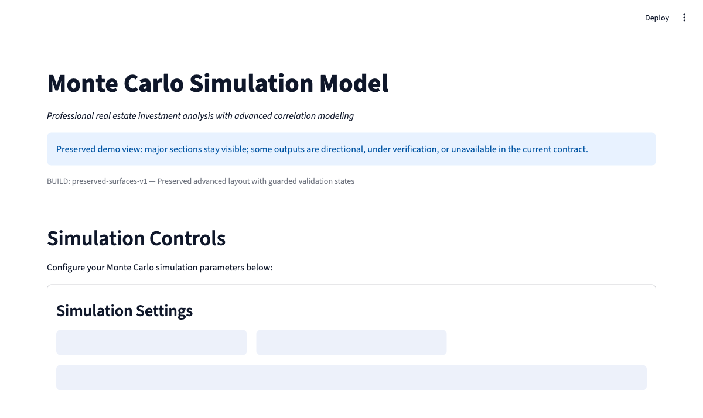
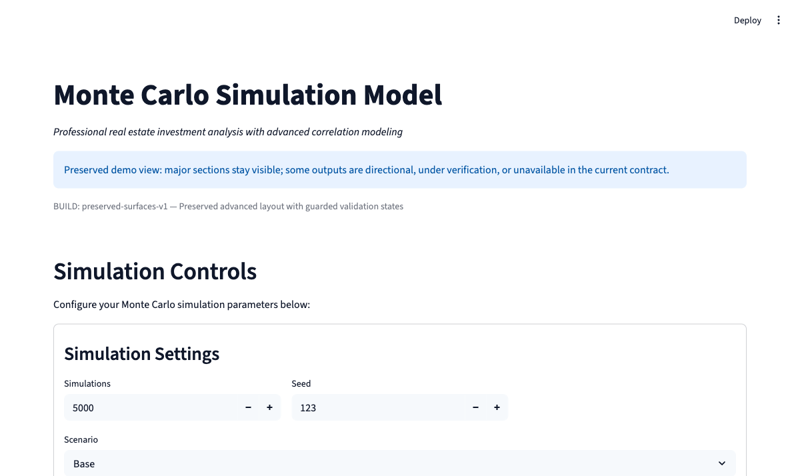
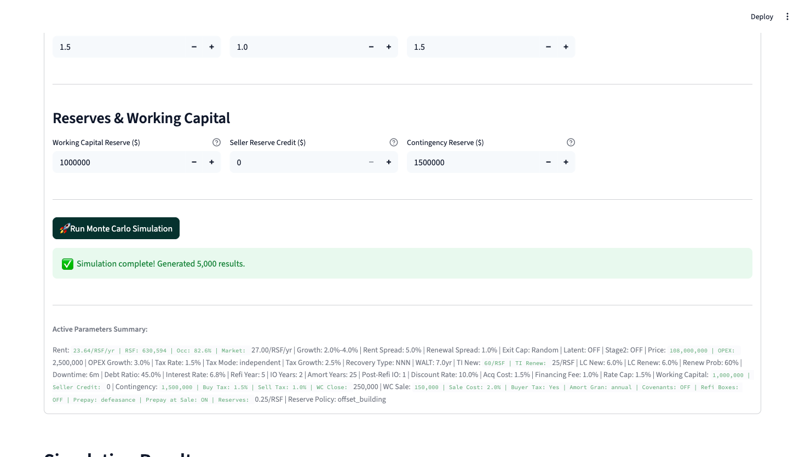

# Monte Carlo Real Estate Analytics Dashboard

This is a Python/Streamlit portfolio project for business-facing real-estate scenario analysis. It demonstrates dashboard development, Monte Carlo simulation workflow, local setup documentation, screenshots, tests, and bounded handoff notes for reviewers. The project is positioned as a local visual demo with a validated annual-model core, not as a hosted release product.

For company review, start here, then use [COMPANY_DEMO_HANDOFF.md](COMPANY_DEMO_HANDOFF.md) for the concise handoff summary and [README_UI_LAUNCH.md](README_UI_LAUNCH.md) for local launch instructions.

## Project Status

| Area | Current status |
| --- | --- |
| Visual demo | Ready for screenshots, walkthrough, and local review |
| Model core | Validated annual-model core with current test evidence |
| Deployment | Local/demo review only; no hosted release is claimed |
| Broader validation | Incomplete across every advanced workflow surface |
| Integrations | Future direction only; no shipped business-system integration is claimed |

## Screenshots







## Why This Matters

The project is strongest as a business analytics dashboard rather than a finance spreadsheet. It gives a reviewer a working example of how client-facing software can turn assumptions into scenario outputs, risk views, sensitivity visuals, and exportable reporting.

For a custom-software or digital-transformation team, the useful signal is the workflow: collect inputs, run a model, display decision metrics, preserve validation notes, and provide a path toward repeatable reporting or later business-system integration.

## Business Workflow Fit

- **Dashboard UI:** Streamlit interface for configuring property, leasing, debt, tax, reserve, and risk assumptions.
- **Scenario analysis:** Monte Carlo runs with IRR, NPV, cash-on-cash, equity multiple, and risk/covenant views.
- **Decision support:** Sensitivity views, Heatmaps, Tornado, and Trace / Explain surfaces are preserved with explicit validation boundaries.
- **Reporting path:** Export surfaces and structured artifacts show how the workflow could later support repeatable client-facing outputs.
- **Future integration path:** The current repo can be framed as a candidate for future reporting, API, assistant, or business-system workflows without claiming those integrations already exist.

## Integration-Ready Export Roadmap

The package includes a local deterministic business-summary export artifact at `artifacts/integration_demo/sample_business_summary.json`. It demonstrates how the current dashboard could later feed reporting, API wrapper, AI/MCP tool, or ERP/Odoo handoff workflows through a structured payload.

This is not a live integration layer: the package does not include Odoo, MCP, ERP, CRM, SAP, OpenAI, or hosted API connectivity. See [docs/KEEWAYS_AI_ERP_EXTENSION_ROADMAP.md](docs/KEEWAYS_AI_ERP_EXTENSION_ROADMAP.md) for the bounded roadmap and validation gates.

## AI Analyst

The dashboard includes an AI Analyst surface for explaining the current simulation outputs in business-facing language. It builds a structured context from the active results and can summarize headline metrics, visible risk flags, missing data, trace boundaries, and number-sanity caveats for unusually strong or review-worthy outputs.

Demo analyst mode works without an API key and remains available for local review. Live LLM responses are attempted only when `OPENAI_API_KEY` is configured and the optional OpenAI SDK is available in the local environment.

The AI Analyst explains what the model currently shows, why strong outputs may appear, and what assumptions should be reviewed. It is not investment advice, not a production AI agent, and not a live MCP, Odoo, ERP, CRM, SAP, or hosted API integration. Future MCP/API/ERP handoff remains roadmap-only.

## Quick Start

### Prerequisites

- Python 3.11+
- A local virtual environment
- Runtime dependencies installed from `requirements.txt`

### Installation

```bash
python3 -m venv .venv
source .venv/bin/activate
python -m pip install -r requirements.txt
python run_ui.py
```

When Streamlit starts, open the local URL printed in the terminal.

## Validation Evidence

The package includes test and audit material so technical reviewers can inspect more than screenshots:

- `python run_tests.py smoke` for a quick model smoke path
- `tests/test_core_model.py` for core model behavior checks
- `tests/test_engine_output_contract.py` for engine output contract coverage
- `tests/audit/test_trace_payload_contract.py` and `tests/audit/test_explain_p50.py` for trace/explain behavior
- `tests/test_ai_context.py`, `tests/test_ai_analyst.py`, and `tests/test_number_sanity.py` for the AI Analyst explanation boundary
- `artifacts/logic_report.json` with `all_pass: true` for the included sanity artifact
- `artifacts/wiring_report.json` for UI-to-engine wiring visibility
- [docs/KEEWAYS_SAFE_CLAIMS.md](docs/KEEWAYS_SAFE_CLAIMS.md) for the current claim boundary

The validation evidence supports the current demo and annual-model core. It does not prove that every visible control, advanced KPI, or preserved workflow surface has complete downstream model coverage.

## Repo Map

```text
monte-carlo-demo-package/
├── README.md                  # Reviewer-facing overview
├── COMPANY_DEMO_HANDOFF.md     # Company-facing handoff notes
├── README_UI_LAUNCH.md         # Local launch guide
├── UI.py                       # Streamlit dashboard
├── rmc_model.py                # Monte Carlo model core
├── engine_output_contract.py   # Output contract helpers
├── trace_tools.py              # Trace / Explain support
├── ui_metrics.py               # UI-facing metrics helpers
├── run_ui.py                   # Canonical local launcher
├── run_tests.py                # Test runner
├── scripts/                    # Local export and verification helpers
├── docs/                       # Safe claims, demo script, contracts
├── tests/                      # Unit, integration, audit, and contract tests
├── screenshots/                # Curated review screenshots
└── artifacts/                  # Logic and wiring reports
```

## Core Components

### `UI.py` - Streamlit Interface

- Dynamic parameter controls with validation messaging
- Cached simulation results for local review performance
- Interactive distribution, sensitivity, covenant, trace, and export surfaces
- Guarded display behavior where parked advanced metrics stay clearly outside the current contract

### `rmc_model.py` - Simulation Engine

- Monte Carlo simulation with configurable assumptions
- Annual-model core used by the dashboard
- Correlation, debt, exit, tax, reserve, and leasing logic
- Error handling and parameter normalization for local runs

### Metrics And Contracts

- `ui_metrics.py`, `metrics_schema.py`, `metrics_utils.py`, and `metrics_registry.py` support structured metric display.
- [docs/metrics_contract.md](docs/metrics_contract.md) documents the metrics API contract.
- [docs/metric_inputs_map.md](docs/metric_inputs_map.md) maps metrics to the inputs expected to influence them.

## Key Capabilities

- Multi-scenario review across base, downside, and upside assumptions
- IRR, NPV, cash-on-cash, equity multiple, DSCR, LTV, and break-even occupancy views
- Directional sensitivity analysis with Heatmaps and model-derived Tornado output
- Covenant and risk inspection surfaces
- Preserved Trace / Explain and export workflow for review

## Testing

```bash
# Install test dependencies
python -m pip install -r requirements_testing.txt

# Run the smoke check
python run_tests.py smoke

# Run a targeted UI defaults test
python -m pytest tests/test_ui_session_defaults.py -q -o addopts=''

# Run targeted core model tests
python -m pytest tests/test_core_model.py -q -o addopts=''

# Run the included advanced metrics test file
python -m pytest tests/test_metrics_full.py -q -o addopts=''
```

## Documentation

- [COMPANY_DEMO_HANDOFF.md](COMPANY_DEMO_HANDOFF.md)
- [README_UI_LAUNCH.md](README_UI_LAUNCH.md)
- [docs/KEEWAYS_SAFE_CLAIMS.md](docs/KEEWAYS_SAFE_CLAIMS.md)
- [docs/KEEWAYS_AI_ERP_EXTENSION_ROADMAP.md](docs/KEEWAYS_AI_ERP_EXTENSION_ROADMAP.md)
- [docs/KEEWAYS_DEMO_SCRIPT.md](docs/KEEWAYS_DEMO_SCRIPT.md)
- [docs/KEEWAYS_POSITIONING_MEMO.md](docs/KEEWAYS_POSITIONING_MEMO.md)
- [docs/metrics_contract.md](docs/metrics_contract.md)
- [docs/metric_inputs_map.md](docs/metric_inputs_map.md)
- [docs/adr/0001_domain_invariants.md](docs/adr/0001_domain_invariants.md)

## Review Access Note

This repository is intended to start private. If it is shared privately, reviewers need GitHub collaborator access before they can open the link. If it is made public later, verify that this README and the screenshots render correctly before sending it.

## Future Workflow Direction

This dashboard is a candidate for a later workflow layer around simulation runs, metric retrieval, risk summaries, trace/explain output, and report generation. That direction fits a broader business-dashboard or digital-transformation story, but it remains future work in this package.

Keep external wording aligned with [docs/KEEWAYS_SAFE_CLAIMS.md](docs/KEEWAYS_SAFE_CLAIMS.md): describe this as a demo-ready analytics dashboard with a validated annual-model core and preserved advanced workflow surfaces, not as a finished platform.
