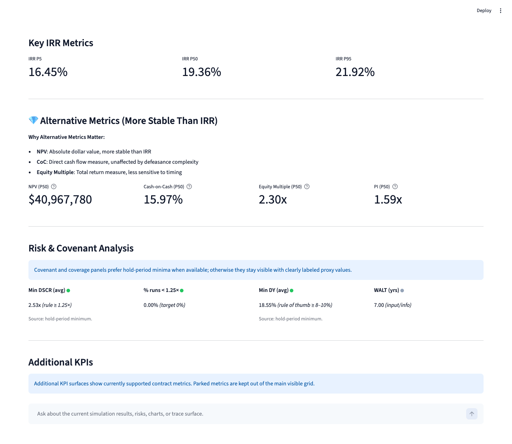
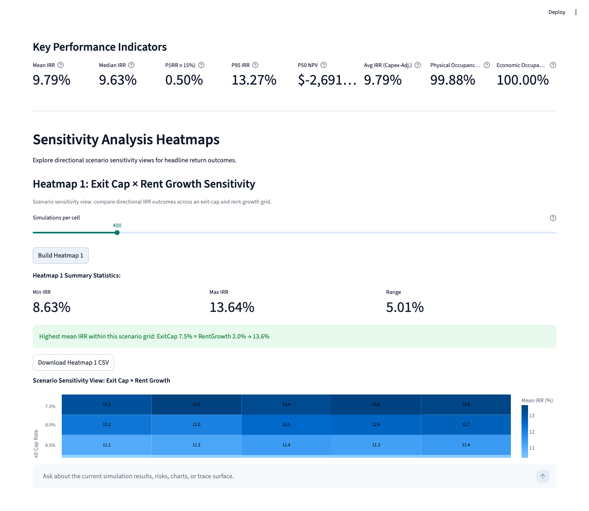
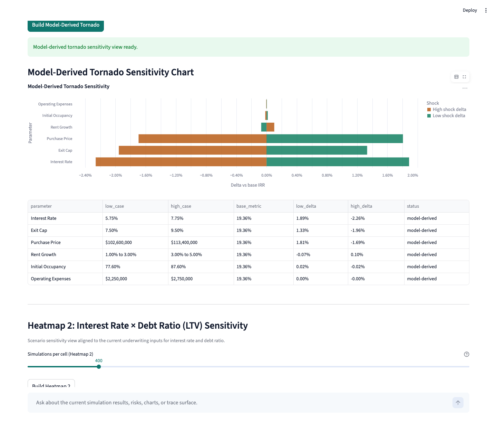
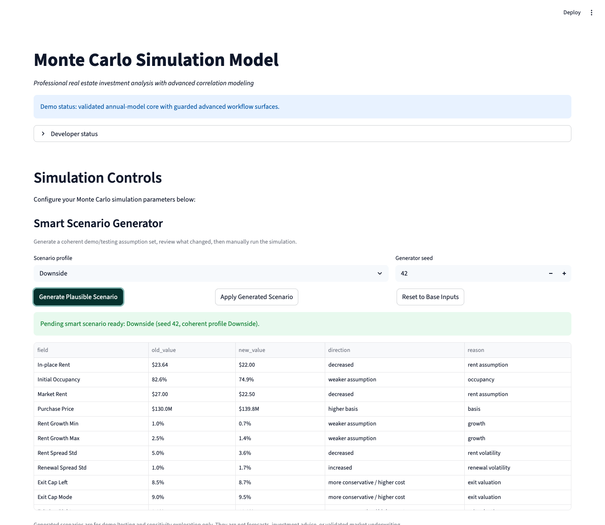
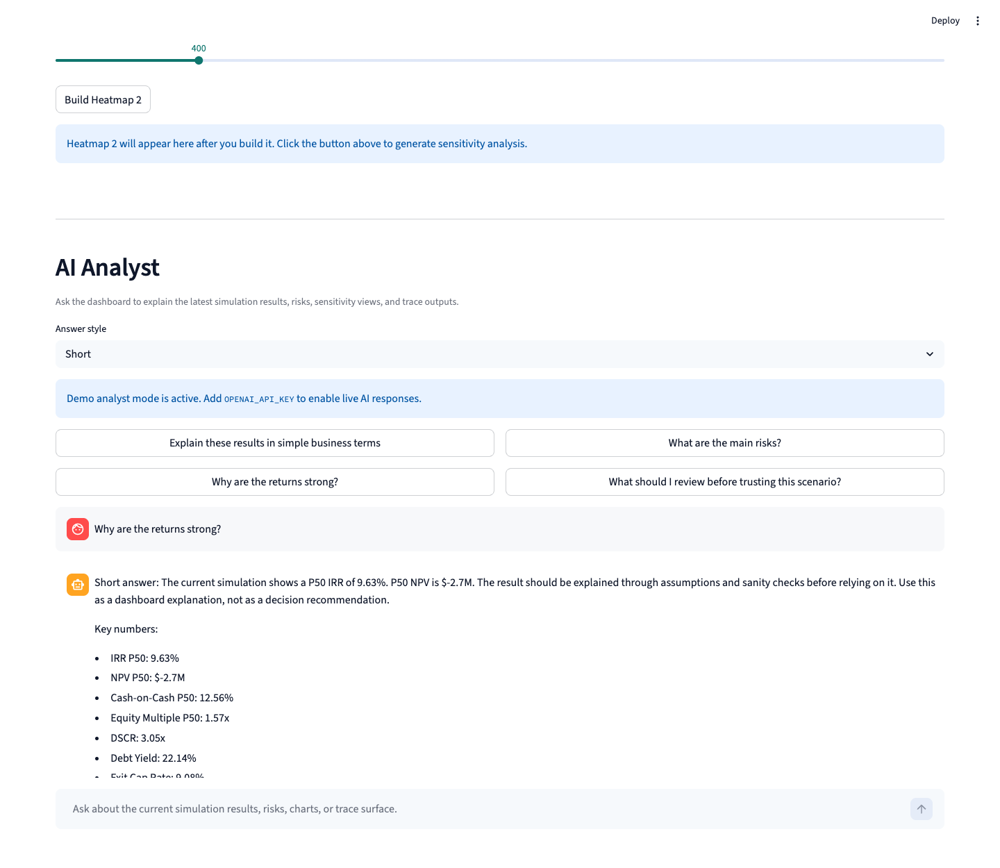

# Business Analytics Workflow Demo

This is a local business analytics workflow demo built with Python, Streamlit, FastAPI, SQLite, and Docker. It uses real-estate Monte Carlo scenario analysis as the domain example, turning assumptions into dashboard views, schema-validated evidence bundles, risk flags, memo-style outputs, and a local API/container proof for reviewer inspection.

For company review, start here, then use [COMPANY_DEMO_HANDOFF.md](COMPANY_DEMO_HANDOFF.md) for the concise handoff summary and [README_UI_LAUNCH.md](README_UI_LAUNCH.md) for local launch instructions. The repo is intentionally scoped as a local portfolio/demo workflow with explicit safety boundaries, not as a hosted release product.

## Reviewer Path

1. Start with the screenshots below to see the dashboard surfaces.
2. Review the proof chain: dashboard UI -> schema-validated exports -> SQLite run registry -> local FastAPI wrapper -> local Docker run.
3. Use [README_UI_LAUNCH.md](README_UI_LAUNCH.md) for a local UI run.
4. Generate the evidence bundle or call the local API to inspect reproducible review artifacts.
5. Read [docs/SAFE_CLAIMS.md](docs/SAFE_CLAIMS.md) for the claim boundary before describing the project externally.

## Open Live Demo

[Open hosted Streamlit visual demo](https://monte-carlo-real-estate-demo-y4cunxqpckm9ynbgvfffgz.streamlit.app)

This hosted link is for visual portfolio review only. It is not production deployment, not investment advice, and not live ERP/Odoo/MCP/SAP integration.

## Demo Walkthrough

A short local walkthrough shows the dashboard, evidence-bundle workflow, FastAPI API, and local container proof.

[](docs/media/demo_walkthrough.mp4)

## What This Proves

- **Custom software workflow packaging:** inputs, model run, dashboard output, validation artifacts, and reviewer handoff are organized as one inspectable flow.
- **API/backend capability:** the evidence-bundle workflow is exposed through a local FastAPI wrapper with server-controlled paths and SQLite run tracking.
- **Client-facing documentation:** launch, handoff, safe-claim, API, and local container instructions are written for reviewers, not only for the original developer.
- **QA discipline:** focused tests cover docs truth, bundle contracts, registry behavior, API behavior, container docs, and smoke execution.
- **Business-system awareness:** local Odoo/ERP-style dry-run payloads show how data could later be shaped for workflow handoff without claiming live integration.

## Project Status

| Area | Current status |
| --- | --- |
| Visual demo | Ready for screenshots, walkthrough, and local review |
| Model core | Validated annual-model core with current test evidence |
| Deployment | Local/demo review only; no hosted release is claimed |
| Broader validation | Incomplete across every advanced workflow surface |
| Integrations | Local Odoo/ERP-style dry-run handoff payload only; no live or production ERP/Odoo sync is claimed |

## Visual Evidence

This repo includes screenshots captured from the running Streamlit dashboard. They show the working surfaces a reviewer is most likely to inspect: KPI outputs, sensitivity views, the Smart Scenario Generator, and the AI Analyst fallback explanation layer.

### KPI / IRR Results


### Heatmap Sensitivity



### Tornado Sensitivity



### Smart Scenario Generator



### AI Analyst Explanation Layer



## Tested Evidence

Latest local verification covers the core demo paths without claiming production readiness:

- Smoke test: passed
- Odoo local/unit suite: passed
- Scenario generator tests: passed
- AI Analyst boundary tests: passed
- Tornado sensitivity tests: passed
- UI/control evidence: screenshots captured from the running Streamlit app

See [docs/SCREENSHOT_EVIDENCE.md](docs/SCREENSHOT_EVIDENCE.md) for the screenshot capture notes.

## Download / Clone The Project

Clone with Git:

```bash
git clone https://github.com/quantfin33/monte-carlo-real-estate-demo.git
cd monte-carlo-real-estate-demo
```

Or download a ZIP from GitHub:

1. Open the repository link.
2. Click the green `Code` button.
3. Click `Download ZIP`.
4. Unzip the folder.
5. Open Terminal inside the unzipped project folder.

Then follow the [local launch guide](README_UI_LAUNCH.md) or use the Quick Start commands below.

## Why This Matters

The project is strongest as a business analytics dashboard rather than a finance spreadsheet. It gives a reviewer a working example of how client-facing software can turn assumptions into scenario outputs, risk views, sensitivity visuals, and exportable reporting.

For a custom-software or digital-transformation team, the useful signal is the workflow: collect inputs, run a model, display decision metrics, preserve validation notes, and provide a path toward repeatable reporting or later business-system integration.

## What This Demo Shows

- Python/Streamlit dashboard development
- Monte Carlo scenario modeling
- Tested annual-model core
- Deterministic exports
- Trace/explain surfaces
- Audit evidence
- Smart Scenario Generator
- AI Analyst fallback/live explanation layer
- QA/testing discipline

## What This Demo Does Not Claim

- Not production financial software
- Not investment advice
- Not a fully validated institutional underwriting engine
- Not production ERP/Odoo/MCP/SAP integration
- Not hosted enterprise deployment

## Business Workflow Fit

- **Dashboard UI:** Streamlit interface for configuring property, leasing, debt, tax, reserve, and risk assumptions.
- **Scenario analysis:** Monte Carlo runs with IRR, NPV, cash-on-cash, equity multiple, and risk/covenant views.
- **Decision support:** Sensitivity views, Heatmaps, Tornado, and Trace / Explain surfaces are preserved with explicit validation boundaries.
- **Reporting path:** Export surfaces and structured artifacts show how the workflow could later support repeatable client-facing outputs.
- **Future integration path:** The current repo can be framed as a candidate for future reporting, API, assistant, or business-system workflows without claiming those integrations already exist.

## Integration-Ready Export Roadmap

The package includes a local deterministic business-summary export artifact at `artifacts/integration_demo/sample_business_summary.json`. It demonstrates how the current dashboard could later feed reporting, API wrapper, AI/MCP tool, or Odoo/ERP-style dry-run handoff workflows through a structured payload.

The repo includes a local Odoo/ERP-style dry-run handoff payload and mapper for demonstrating how reporting data could be shaped for a future workflow. Sandbox validation evidence may be documented separately; no live or production Odoo/ERP integration is included. This is not ERP/Odoo sync, not hosted workflow automation, and not an MCP/SAP integration. See [docs/AI_ERP_EXTENSION_ROADMAP.md](docs/AI_ERP_EXTENSION_ROADMAP.md) and [docs/WORKFLOW_PRODUCT_ROADMAP.md](docs/WORKFLOW_PRODUCT_ROADMAP.md) for bounded roadmap notes.

## AI Analyst

The dashboard includes an AI Analyst surface for explaining the current simulation outputs in business-facing language. It builds a structured context from the active results and can summarize headline metrics, visible risk flags, missing data, trace boundaries, and number-sanity caveats for unusually strong or review-worthy outputs.

Demo analyst mode works without an API key and remains available for local review. Live LLM responses are attempted only when `OPENAI_API_KEY` is configured and the optional OpenAI SDK is available in the local environment.

The AI Analyst explains what the model currently shows, why strong outputs may appear, and what assumptions should be reviewed. It is not investment advice, not a production AI agent, and not a live MCP, Odoo, ERP, CRM, SAP, or hosted API integration. Future MCP/API/ERP handoff remains roadmap-only.

## Quick Start

### Prerequisites

- Python 3.11+
- A local virtual environment
- Runtime dependencies installed from `requirements.txt`

### Installation

```bash
python3 -m venv .venv
source .venv/bin/activate
python -m pip install -r requirements.txt
python run_ui.py
```

When Streamlit starts, open the local URL printed in the terminal.

## Evidence Bundle And Optional Registry

Generate a local review bundle with schema-validated artifacts:

```bash
python scripts/generate_demo_bundle.py --preset base --seed 123 --out /tmp/rmc_demo_bundle --n 2 --sims-per-case 1
```

Optionally record successful bundle runs in a local SQLite sidecar registry:

```bash
python scripts/generate_demo_bundle.py --preset base --seed 123 --out /tmp/rmc_demo_bundle --n 2 --sims-per-case 1 --registry-db /tmp/rmc_demo_registry.sqlite
```

The bundle creates local review artifacts for assumptions, business summary, AI context, scenario matrix, risk flags, dry-run Odoo/ERP-style handoff payload, validation report, and memo output. The SQLite registry is optional and sidecar-only; no network calls are made, and this is not live ERP/Odoo integration.

## Local API Wrapper

The repository also includes a small local-only FastAPI wrapper around the evidence-bundle workflow:

```bash
uvicorn api_app:app --reload
```

Example local request:

```bash
curl -X POST http://127.0.0.1:8000/run-bundle \
  -H "Content-Type: application/json" \
  -d '{"preset":"base","seed":123,"n":2,"sims_per_case":1}'
```

The API writes bundles under a server-controlled local folder, records successful validated runs in the optional SQLite sidecar registry, and exposes only fixed bundle artifacts by `run_id`. It is a local demo API only, not hosted deployment, not live ERP/Odoo/MCP/SAP integration, and not investment advice.

## Local Container Run

For local container reproducibility, see [docs/LOCAL_CONTAINER_RUN.md](docs/LOCAL_CONTAINER_RUN.md). This is a local container proof only, not hosted deployment, not production hardening, not live ERP/Odoo/MCP/SAP integration, and not investment advice.

## Validation Evidence

The package includes test and audit material so technical reviewers can inspect more than screenshots:

Quick checks:

- Fresh-clone/startup verification has passed for the current GitHub package.
- `python run_tests.py smoke` for a quick model smoke path
- [docs/SAFE_CLAIMS.md](docs/SAFE_CLAIMS.md) for the current claim boundary

Deeper audit evidence:

- `tests/test_core_model.py` for core model behavior checks
- `tests/test_engine_output_contract.py` for engine output contract coverage
- `tests/audit/test_trace_payload_contract.py` and `tests/audit/test_explain_p50.py` for trace/explain behavior
- `tests/test_ai_context.py`, `tests/test_ai_analyst.py`, and `tests/test_number_sanity.py` for the AI Analyst explanation boundary
- `tests/test_button_audit.py`, `tests/test_tornado_sensitivity.py`, and `tests/test_number_audit.py` for helper/audit behavior
- 50 deterministic scenario checks were run during final readiness review
- `tests/ui/test_streamlit_apptest_controls.py` for Streamlit UI AppTest coverage
- `scripts/ui_control_audit.py` inventoried 151 Streamlit controls before the Smart Scenario Generator merge
- `tests/test_scenario_randomizer.py` for Smart Scenario Generator invariants
- `artifacts/logic_report.json` with `all_pass: true` for the included sanity artifact
- `artifacts/wiring_report.json` for UI-to-engine wiring visibility

The validation evidence supports the current demo and annual-model core. It does not prove that every visible control, advanced KPI, or preserved workflow surface has complete downstream model coverage.

## Repo Map

```text
monte-carlo-demo-package/
├── README.md                  # Reviewer-facing overview
├── COMPANY_DEMO_HANDOFF.md     # Company-facing handoff notes
├── README_UI_LAUNCH.md         # Local launch guide
├── UI.py                       # Streamlit dashboard
├── monte_carlo_model.py        # Monte Carlo model core
├── engine_output_contract.py   # Output contract helpers
├── trace_tools.py              # Trace / Explain support
├── ui_metrics.py               # UI-facing metrics helpers
├── run_registry.py             # Optional local SQLite run registry
├── run_ui.py                   # Canonical local launcher
├── run_tests.py                # Test runner
├── scripts/generate_demo_bundle.py # Local evidence-bundle generator
├── scripts/                    # Other local export and verification helpers
├── schemas/export_contracts/   # JSON schemas for bundle artifacts
├── docs/                       # Safe claims, workflow roadmap, demo script, contracts
├── tests/                      # Unit, integration, audit, and contract tests
├── screenshots/                # Curated review screenshots
└── artifacts/                  # Logic and wiring reports
```

## Core Components

### `UI.py` - Streamlit Interface

- Dynamic parameter controls with validation messaging
- Cached simulation results for local review performance
- Interactive distribution, sensitivity, covenant, trace, and export surfaces
- Guarded display behavior where parked advanced metrics stay clearly outside the current contract

### `monte_carlo_model.py` - Simulation Engine

- Monte Carlo simulation with configurable assumptions
- Annual-model core used by the dashboard
- Correlation, debt, exit, tax, reserve, and leasing logic
- Error handling and parameter normalization for local runs

### Metrics And Contracts

- `ui_metrics.py`, `metrics_schema.py`, `metrics_utils.py`, and `metrics_registry.py` support structured metric display.
- [docs/metrics_contract.md](docs/metrics_contract.md) documents the metrics API contract.
- [docs/metric_inputs_map.md](docs/metric_inputs_map.md) maps metrics to the inputs expected to influence them.

## Key Capabilities

- Multi-scenario review across base, downside, and upside assumptions
- IRR, NPV, cash-on-cash, equity multiple, DSCR, LTV, and break-even occupancy views
- Directional sensitivity analysis with Heatmaps and model-derived Tornado output
- Covenant and risk inspection surfaces
- Preserved Trace / Explain and export workflow for review

## Testing

```bash
# Install test dependencies
python -m pip install -r requirements_testing.txt

# Run the smoke check
python run_tests.py smoke

# Run a targeted UI defaults test
python -m pytest tests/test_ui_session_defaults.py -q -o addopts=''

# Run targeted core model tests
python -m pytest tests/test_core_model.py -q -o addopts=''

# Run the included advanced metrics test file
python -m pytest tests/test_metrics_full.py -q -o addopts=''
```

## Documentation

- [COMPANY_DEMO_HANDOFF.md](COMPANY_DEMO_HANDOFF.md)
- [README_UI_LAUNCH.md](README_UI_LAUNCH.md)
- [docs/SAFE_CLAIMS.md](docs/SAFE_CLAIMS.md)
- [docs/DEMO_ASSUMPTION_BOUNDARY.md](docs/DEMO_ASSUMPTION_BOUNDARY.md)
- [docs/AI_ERP_EXTENSION_ROADMAP.md](docs/AI_ERP_EXTENSION_ROADMAP.md)
- [docs/WORKFLOW_PRODUCT_ROADMAP.md](docs/WORKFLOW_PRODUCT_ROADMAP.md)
- [docs/DEMO_SCRIPT.md](docs/DEMO_SCRIPT.md)
- [docs/POSITIONING_MEMO.md](docs/POSITIONING_MEMO.md)
- [docs/metrics_contract.md](docs/metrics_contract.md)
- [docs/metric_inputs_map.md](docs/metric_inputs_map.md)
- [docs/adr/0001_domain_invariants.md](docs/adr/0001_domain_invariants.md)

## Reviewer / Sharing Note

This public repository is intended as a portfolio demo. Non-technical reviewers can start with the screenshots, this README, [COMPANY_DEMO_HANDOFF.md](COMPANY_DEMO_HANDOFF.md), and the [launch guide](README_UI_LAUNCH.md).

## Future Workflow Direction

This dashboard is a candidate for a later workflow layer around simulation runs, metric retrieval, risk summaries, trace/explain output, and report generation. That direction fits a broader business-dashboard or digital-transformation story, but it remains future work in this package.

Keep external wording aligned with [docs/SAFE_CLAIMS.md](docs/SAFE_CLAIMS.md): describe this as a demo-ready analytics dashboard with a validated annual-model core and preserved advanced workflow surfaces, not as a finished platform.
